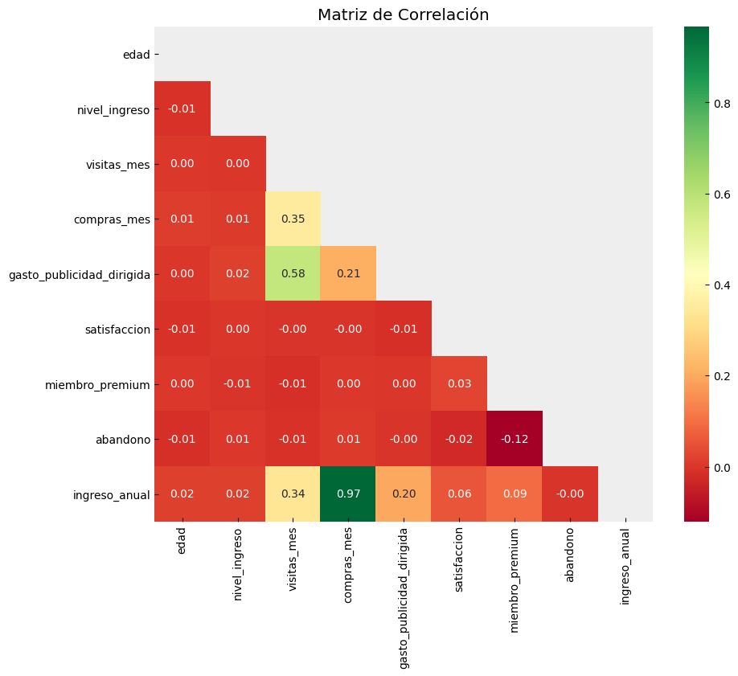
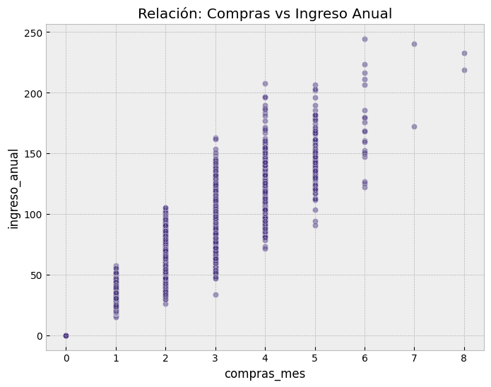

# NovaRetail+ — Customer Behavior Analytics


## Resumen del Proyecto

Este proyecto consiste en un **análisis correlacional exploratorio** de
la base de datos de clientes de **NovaRetail+**, una plataforma de
comercio electrónico líder en Latinoamérica.

El equipo de Crecimiento y Retención necesita comprender el comportamiento
de compra de los usuarios al cierre del año 2024. Pregunta de negocio:

> **¿Qué factores del comportamiento del cliente están más fuertemente
> asociados con el ingreso anual generado?**

## Dataset

`novaretail_comportamiento_clientes_2024.csv` — **15,000 registros × 12 columnas**

| Columna | Tipo | Descripción |
|---|---|---|
| `id_cliente` | object | Identificador único |
| `edad` | int | Perfil demográfico |
| `nivel_ingreso` | float | Ingreso base del cliente |
| `visitas_mes` | int | Hábitos de tráfico |
| `compras_mes` | int | Frecuencia transaccional |
| `gasto_publicidad_dirigida` | float | Inversión en marketing por usuario |
| `satisfaccion` | float | Calificación 1 a 5 |
| `miembro_premium` | int (binaria) | Estatus de membresía |
| `abandono` | int (binaria) | Churn del usuario |
| `tipo_dispositivo` | object | móvil / escritorio / tablet |
| `region` | object | norte / sur / este / oeste |
| `ingreso_anual` | float | **Variable objetivo** |

## Preparación de Datos

El dataset llegó en condiciones sólidas — cero valores nulos en las
12 columnas. Las transformaciones aplicadas fueron:

- `edad`: tipo `float64` → convertido a `int64` (sin decimales reales)
- Sin duplicados detectados
- Sin sentinels ni valores fuera de rango
- Sin fechas problemáticas

**El dataset estaba listo para análisis directo.** El esfuerzo se
concentró en la validación estadística, no en corrección de datos.

## Estadísticas Descriptivas Clave

| Métrica | Valor |
|---|---|
| Edad promedio | 38 años (rango: 18-75) |
| Ingreso anual promedio | $36.59 USD |
| Ingreso anual máximo | $244.69 USD |
| Compras/mes promedio | 1.21 |
| Visitas/mes promedio | 10.03 |
| Gasto publicidad promedio | $20.15 USD |
| Satisfacción promedio | 3.60 / 5.00 |

**Distribución por dispositivo:**
- Móvil: **65.45%** (9,818 usuarios)
- Escritorio: 24.80% (3,720 usuarios)
- Tablet: 9.75% (1,462 usuarios)

**Distribución por plan:**
- No premium: 86.07%
- Premium: **13.93%**

**Churn:**
- Retenidos: 84.93%
- Abandonaron: **15.07%**

## Metodología Estadística

Tres técnicas aplicadas según el tipo de variable:

1. **Pearson y Spearman** — variables numéricas continuas
   (detecta relaciones lineales vs. monotónicas)
2. **V de Cramér + Chi-cuadrado** — variables categóricas nominales
   (asociación territorial y de dispositivos)
3. **Correlación Punto-biserial** — variables mixtas binaria vs. continua
   (impacto de membresía Premium y abandono sobre ingreso anual)

## Hallazgos Principales

**Recurrencia transaccional — el motor real del ingreso:**
- Pearson (compras_mes ↔ ingreso_anual): **r = 0.9671**
- Spearman (compras_mes ↔ ingreso_anual): **r = 0.9675**
- Conclusión: La frecuencia de compra es el predictor casi perfecto
  del ingreso. No las visitas, no la publicidad — las compras.

**Ilusión publicitaria:**
- Publicidad ↔ visitas_mes: r = 0.58 (atrae tráfico)
- Publicidad ↔ ingreso_anual: r = 0.20 (no cierra ventas)
- Conclusión: El gasto en publicidad es un motor de tráfico,
  no un motor de conversión.

**Dominio móvil:**
- 65.45% del tráfico desde dispositivos móviles
- Tasa de conversión móvil: 11.94% vs. otros: 12.04%
- Conclusión: El volumen es móvil pero la conversión es ligeramente
  menor — UX mobile-first es la inversión prioritaria.

**Anomalía crítica de churn:**
- Usuarios que abandonaron tenían compras_mes promedio +2.13%
  superiores a los retenidos
- Satisfacción de quienes abandonan: 3.56 vs. 3.61 retenidos
  (diferencia mínima)
- Conclusión: NovaRetail+ pierde a sus mejores clientes, no a los
  insatisfechos. El churn es operativo o post-compra, no por
  insatisfacción con el producto.

## Visualizaciones Clave

**Matriz de Correlación — visión completa de asociaciones**


*El verde intenso en compras_mes ↔ ingreso_anual (r=0.97) contrasta
con el resto de variables, confirmando que la recurrencia transaccional
es el único predictor real de ingreso.*

**Scatterplot — evidencia visual de r=0.97**


*Cada columna de puntos representa un nivel de compras_mes.
El escalamiento casi perfecto del ingreso con cada compra adicional
confirma la correlación cuasi-lineal.*

## Recomendaciones Estratégicas

1. **Optimizar conversión, no tráfico:** Redirigir presupuesto de
   publicidad (r=0.20 en ingreso) hacia mejoras en el flujo de compra
   donde la recurrencia (r=0.97) genera el valor real.

2. **Mobile-first es urgente:** Con 65.45% del tráfico en móvil y
   conversión ligeramente inferior, cada punto de mejora en UX
   móvil impacta directamente en ingreso.

3. **Auditar el ciclo post-compra:** El churn ataca a power users con
   compras superiores a la media. El problema no es adquisición —
   es retención operativa. Revisar logística, soporte y experiencia
   post-venta.


[Ver notebook completo](./S8_Student%20Version-Project-NovaRetail.ipynb)

## Estructura del Repositorio
```
📦 Proyecto-7-NovaRetail-Correlational-Analysis
 ┣ 📂 img
 ┃ ┣ 🖼️ matriz_correlacion.png     → Heatmap de correlación completo
 ┃ ┗ 🖼️ compras_vs_ingreso.png     → Scatterplot r=0.97
 ┣ 📓 S8_Student Version-Project-NovaRetail.ipynb → Análisis completo
 ┗ 📋 README.md                    → Este archivo
```
## Autor

David Germán Ramos Rodríguez
[LinkedIn](https://www.linkedin.com/in/david-g-ramos/) |
[Portfolio](https://dataanalist-davidgramos.github.io/mi-sitio-web/)

---
> *"Fiel al análisis de datos, ausente de fantasmas y con rigor científico."*
